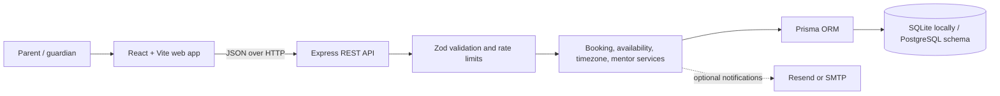

<div align="center">


# Codeyoung Trial Class Booking

**A thoughtful first step into coding — made simple for families.**
Book a free, mentor-led coding trial with clear scheduling, local times, and a guided experience from start to confirmation.

[**✨ Try the live application**](https://codeyoungassessment.vercel.app/)

<br />


</div>


## Overview

| | |
|---|---|
| **Live application** | [codeyoungassessment.vercel.app](https://codeyoungassessment.vercel.app/) |
| **Frontend** | React 19, TypeScript, Vite, Tailwind CSS 4 |
| **Backend** | Node.js, Express 4, Zod |
| **Data layer** | Prisma ORM — SQLite for local development, PostgreSQL schema available |
| **Tests** | Node.js built-in test runner and Supertest |
| **AI session file** | [`TRANSCRIPT.md`](TRANSCRIPT.md) |

> **Prototype note:** class links are generated as demo URLs. This project does not integrate a live video-classroom provider.

## The experience

Families can book a free, 45-minute coding trial for a learner in four guided steps. The flow is fully responsive and ships with light and dark themes.

| Step | What the family does | What the system handles |
|:---:|---|---|
| **01 · Learner** | Share the learner's age, grade, interests, and guardian contact details. | Validates required fields; keeps the student email optional. |
| **02 · Schedule** | Choose a weekday, timezone, and available 45-minute slot. | Converts local time correctly across IANA zones and DST changes. |
| **03 · Mentor** | Review mentors available for the selected time. | Checks work hours, daily limits, and overlapping bookings. |
| **04 · Confirm** | Review the details and confirm the free trial. | Saves the booking and prepares parent/mentor notifications. |

## Highlights

- 🤖 **Booking assistant + general chat** — two focused modes; general answers are rule-based and don't call an external AI service.
- ⚖️ **Fair mentor assignment** — weekday working hours are 10:00–21:00 in Asia/Kolkata, with each mentor capped at two trials per local day.
- 📊 **Capacity feedback** — slot availability and remaining daily capacity are shown before confirmation.
- 📧 **Resilient notifications** — optional Resend or SMTP delivery; email errors never block booking completion.
- 🔒 **Secure API defaults** — Zod validation, Helmet headers, rate limiting, and centralized, safe error responses.
- 🗄️ **Local-first setup** — SQLite plus seeded demo mentors work with no separately managed database server.

## Screenshots

<details open>
<summary><strong>Home &amp; assistant</strong></summary>
<br />

<table>
  <tr>
    <th>Home · Light theme</th>
    <th>Home · Dark theme</th>
  </tr>
  <tr>
    <td align="center"><a href="Premium%20Trial%20Class%20Booking/public/light.jpg"></a></td>
    <td align="center"><a href="Premium%20Trial%20Class%20Booking/public/dark.jpg"></a></td>
  </tr>
  <tr>
    <th>Booking assistant</th>
    <th>General chat</th>
  </tr>
  <tr>
    <td align="center"><a href="Premium%20Trial%20Class%20Booking/public/chatbot.jpg"></a></td>
    <td align="center"><a href="Premium%20Trial%20Class%20Booking/public/chatbot1.jpg"></a></td>
  </tr>
</table>
</details>

<details open>
<summary><strong>Booking flow</strong></summary>
<br />

<table>
  <tr>
    <th>Student details</th>
    <th>Parent details</th>
  </tr>
  <tr>
    <td align="center"><a href="Premium%20Trial%20Class%20Booking/public/student.jpg"></a></td>
    <td align="center"><a href="Premium%20Trial%20Class%20Booking/public/parent.jpg"></a></td>
  </tr>
  <tr>
    <th>Date, timezone &amp; available times</th>
    <th>Booking review</th>
  </tr>
  <tr>
    <td align="center"><a href="Premium%20Trial%20Class%20Booking/public/time.jpg"></a></td>
    <td align="center"><a href="Premium%20Trial%20Class%20Booking/public/draft.jpg"></a></td>
  </tr>
</table>
</details>

<details open>
<summary><strong>Confirmation &amp; notifications</strong></summary>
<br />

<table>
  <tr>
    <th>Booking confirmation</th>
    <th>Parent confirmation email</th>
  </tr>
  <tr>
    <td align="center"><a href="Premium%20Trial%20Class%20Booking/public/conform.jpg"></a></td>
    <td align="center"><a href="Premium%20Trial%20Class%20Booking/public/parent%20mail.jpg"></a></td>
  </tr>
  <tr>
    <th>Mentor notification email</th>
    <th></th>
  </tr>
  <tr>
    <td align="center"><a href="Premium%20Trial%20Class%20Booking/public/mentor%20mail.jpg"></a></td>
    <td></td>
  </tr>
</table>
</details>

Screenshots live in `Premium Trial Class Booking/public/`. **Before making the repository public**, confirm the email and booking screenshots contain only safe demo data — no private addresses or real booking details.

## Architecture



## Repository layout

```text
.
├── package.json                         # Root scripts for running/testing the app
├── scripts/start-dev.js                 # Starts frontend and backend together
├── TRANSCRIPT.md                        # AI-assisted implementation notes
├── Premium Trial Class Booking/         # React + Vite frontend
│   ├── public/                          # Logo, mentor photo, and README screenshots
│   └── src/
│       ├── App.tsx                      # Pages, booking flow, and assistant
│       ├── index.css                    # Design system and responsive styles
│       └── services/api.ts              # Frontend API client
└── server/                              # Express + Prisma backend
    ├── prisma/                          # SQLite and PostgreSQL schemas, seed data
    ├── src/
    │   ├── controllers/                 # HTTP request handlers
    │   ├── middleware/                  # Validation, rate limiting, errors
    │   ├── routes/                      # REST API routes
    │   └── services/                    # Booking, scheduling, email, timezone
    └── tests/                           # Service, validation, and timezone tests
```

## Getting started

### Prerequisites

- Node.js supported by Vite 8 (Node 20.19+ or 22.12+ recommended)
- npm

### 1 · Install dependencies

From the repository root:

```powershell
cd server
npm install
Copy-Item .env.example .env

cd "..\Premium Trial Class Booking"
npm install
cd ..
```

> On macOS/Linux, replace `Copy-Item .env.example .env` with `cp .env.example .env`.

### 2 · Prepare the local database

Run from the `server` directory:

```powershell
cd server
npx prisma generate
npm run prisma:push
npm run prisma:seed
cd ..
```

This uses the SQLite URL from `server/.env.example`, so no separate database server is required for local development. The seed command can be rerun safely — it upserts the demo mentors.

### 3 · Start the app

From the repository root, start both services together:

```powershell
npm run dev
```

By default, the frontend runs at **http://localhost:8443** and the API at **http://localhost:5000**. Check the backend at [http://localhost:5000/api/health](http://localhost:5000/api/health).

Or run each service separately, in two terminals:

```powershell
npm run dev:server
```

```powershell
npm run dev:client
```

### Email configuration

Email is optional for local development — with no provider credentials set, the app logs a dry-run message instead of sending mail. To test real delivery, configure a provider in `server/.env` using the variable names in [`server/.env.example`](server/.env.example). Use verified sender addresses for production.

> ⚠️ Never commit `.env` files, API keys, database passwords, or real user data. Configure production values in your hosting provider's private environment-variable settings.

## Build and test

From the repository root:

```powershell
npm run build:client
npm run test:server
```

Equivalent package-level commands:

```powershell
cd "Premium Trial Class Booking"
npm run build

cd ..\server
npm test
```

Server tests cover timezone conversion and daylight-saving behavior, booking validation, mentor assignment and capacity rules, class-link generation, and email failure handling.

## API reference

Mounted under `/api` (default local base URL: `http://localhost:5000/api`).

| Method | Endpoint | Purpose |
|---|---|---|
| `GET` | `/health` | Service health check |
| `GET` | `/availability?date=YYYY-MM-DD&timezone=America%2FNew_York` | List slots and daily capacity for a date/timezone |
| `POST` | `/bookings` | Create a trial booking |
| `GET` | `/bookings/:id` | Retrieve booking details |
| `GET` | `/bookings/:id/class-link` | Retrieve the generated demo class link |

Example availability request:

```bash
curl "http://localhost:5000/api/availability?date=2026-09-30&timezone=America%2FNew_York"
```

A booking request includes `parent`, `student`, `date`, `time`, and an IANA `timezone`. `mentorId` is optional for API clients — when omitted, the backend assigns an available mentor. The frontend booking flow lets the family choose from mentors available for the selected slot.

## Database options

| Environment | Schema | Notes |
|---|---|---|
| **Local development** | `server/prisma/schema.prisma` | Uses SQLite, configured via `DATABASE_URL` in `server/.env`. |
| **PostgreSQL** | `server/prisma/schema.postgresql.prisma` | For hosted deployments. Configure a PostgreSQL `DATABASE_URL`, then from `server/` run `npm run prisma:generate:postgres` and, for a new database, `npm run prisma:push:postgres`. |

> ⚠️ Do not run schema-push or seed commands against a database containing important data without reviewing the schema and taking a backup first.

## Deployment

The submitted frontend is live at [https://codeyoungassessment.vercel.app/](https://codeyoungassessment.vercel.app/). Override the frontend's API base with `VITE_API_BASE_URL`; production deployments should point it to the deployed backend's `/api` URL and then rebuild and redeploy the frontend.

For a backend deployment, configure `DATABASE_URL`, `CLIENT_URL`, `NODE_ENV`, and `PORT` in the hosting provider. Generate Prisma using the schema that matches the selected database, and configure a verified email sender with private credentials only when email delivery is required.

---

<div align="center">

Built for the Codeyoung assessment · see [`TRANSCRIPT.md`](TRANSCRIPT.md) for the AI-assisted implementation notes

</div>
