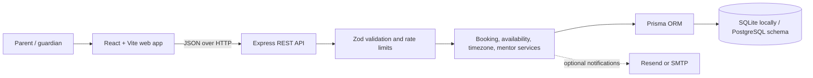

<p align="center">
  
</p>

<h1 align="center">Codeyoung Trial Class Booking</h1>

<p align="center">
  A responsive trial-class booking experience for families, with timezone-aware availability, mentor selection, and a Node.js booking API.
</p>

<p align="center">
  <a href="https://codeyoungassessment.vercel.app/"><strong>Open the live project →</strong></a>
</p>

<p align="center">
  
  
  
  
</p>

---

## At a glance

| | |
|---|---|
| **Live application** | [codeyoungassessment.vercel.app](https://codeyoungassessment.vercel.app/) |
| **Frontend** | React 19, TypeScript, Vite, Tailwind CSS 4 |
| **Backend** | Node.js, Express 4, Zod |
| **Data** | Prisma ORM; SQLite for local development, PostgreSQL schema available |
| **Tests** | Node.js built-in test runner and Supertest |
| **AI session file** | [`TRANSCRIPT.md`](TRANSCRIPT.md) |

## Product overview

Families can book a free, 45-minute coding trial for a learner. The interface walks them through learner and parent details, local date/time selection, an available mentor, and a final booking review. The experience is responsive and includes light and dark themes.

### What’s included

- **Guided booking flow** — collect learner and guardian details, choose a date and timezone, review available class times and mentors, and confirm the booking.
- **Timezone-aware scheduling** — use IANA timezone names and convert booking times to UTC with Luxon, including daylight-saving changes.
- **Mentor availability rules** — check working hours (weekdays, 10:00–21:00 in Asia/Kolkata), overlapping bookings, and a maximum of two trial classes per mentor per local day.
- **Capacity feedback** — show available slots and remaining daily capacity before a family submits a booking.
- **Booking notifications** — optional Resend or SMTP email delivery for parent confirmations and mentor notifications. Without a configured provider, email runs in dry-run/log-only mode.
- **Floating assistant** — separate **Booking** and **General chat** modes. General chat provides quick, rule-based answers about trial classes, programs, mentors, scheduling, and preparation; it does not call an external AI service.
- **API safeguards** — Zod request validation, Helmet headers, rate limiting, and centralized error responses.
- **Demo mentor data** — seed ten mentor records for local development.

> **Prototype note:** class links are generated as demo URLs. This project does not integrate a live video-classroom provider.

## Screenshots

Screenshot images are not currently stored in this repository. Add the images you want to publish under [`docs/screenshots/`](docs/screenshots/); the folder README contains suggested names and privacy guidance. Once uploaded, link them here with relative Markdown paths—for example, ``—and GitHub will render them in this section.

Suggested gallery: light and dark home pages, booking assistant, general chat, booking details, availability, mentor selection, confirmation, and the two email templates. Please crop out personal data, booking IDs, and credentials before committing screenshots.

## Architecture



### Repository layout

```text
.
├── package.json                         # Root scripts for running/testing the app
├── scripts/start-dev.js                 # Starts frontend and backend together
├── docs/screenshots/                    # Add README screenshots here
├── TRANSCRIPT.md                        # AI-assisted implementation notes
├── Premium Trial Class Booking/         # React + Vite frontend
│   ├── public/                          # Public images and favicon
│   └── src/
│       ├── App.tsx                      # Pages, booking flow, and assistant
│       ├── index.css                    # Design system and responsive styles
│       └── services/api.ts              # Frontend API client
└── server/                              # Express + Prisma backend
    ├── prisma/                          # SQLite and PostgreSQL schemas, seed data
    ├── src/
    │   ├── controllers/                 # HTTP request handlers
    │   ├── middleware/                  # Validation, rate limiting, errors
    │   ├── routes/                      # REST API routes
    │   └── services/                    # Booking, scheduling, email, timezone
    └── tests/                           # Service, validation, and timezone tests
```

## Run locally

### Prerequisites

- Node.js supported by Vite 8 (Node 20.19+ or 22.12+ recommended)
- npm

### 1. Install dependencies

From the repository root:

```powershell
cd server
npm install
Copy-Item .env.example .env

cd "..\Premium Trial Class Booking"
npm install
cd ..
```

On macOS/Linux, replace `Copy-Item .env.example .env` with `cp .env.example .env`.

### 2. Prepare the local database

Run from the `server` directory:

```powershell
cd server
npx prisma generate
npm run prisma:push
npm run prisma:seed
cd ..
```

This uses the SQLite URL from `server/.env.example`; a separate database server is not required for local development. The seed command can be rerun safely to upsert the demo mentors.

### 3. Start the app

From the repository root, start both services:

```powershell
npm run dev
```

By default, the frontend is at **http://localhost:8443** and the API is at **http://localhost:5000**. Check the backend with [http://localhost:5000/api/health](http://localhost:5000/api/health).

You can also run services separately from the root in two terminals:

```powershell
npm run dev:server
```

```powershell
npm run dev:client
```

### Email configuration

Email is optional for local development. With no email provider credentials, the app logs a dry-run message instead of sending mail. To test real delivery, configure a provider in `server/.env` using the variable names in [`server/.env.example`](server/.env.example). Use verified sender addresses for production.

Never commit `.env` files, API keys, database passwords, or real user data. Configure production values in your hosting provider’s private environment-variable settings.

## Build and test

From the repository root:

```powershell
npm run build:client
npm run test:server
```

Equivalent package-level commands:

```powershell
cd "Premium Trial Class Booking"
npm run build

cd ..\server
npm test
```

The server tests cover timezone conversion and daylight-saving behavior, booking validation, mentor assignment and capacity rules, class-link generation, and email failure handling.

## API reference

The API is mounted under `/api` (default local base URL: `http://localhost:5000/api`).

| Method | Endpoint | Purpose |
|---|---|---|
| `GET` | `/health` | Service health check |
| `GET` | `/availability?date=YYYY-MM-DD&timezone=America%2FNew_York` | List slots and daily capacity for a date/timezone |
| `POST` | `/bookings` | Create a trial booking |
| `GET` | `/bookings/:id` | Retrieve booking details |
| `GET` | `/bookings/:id/class-link` | Retrieve the generated demo class link |

Example availability request:

```bash
curl "http://localhost:5000/api/availability?date=2026-09-30&timezone=America%2FNew_York"
```

A booking request contains `parent`, `student`, `date`, `time`, and an IANA `timezone`. `mentorId` is optional for API clients; when omitted, the backend assigns an available mentor. The frontend booking flow lets the family choose from mentors available for the selected slot.

## Database options

- **Local development:** `server/prisma/schema.prisma` uses SQLite and is configured by `DATABASE_URL` in `server/.env`.
- **PostgreSQL:** `server/prisma/schema.postgresql.prisma` is provided for hosted deployments. Configure a PostgreSQL `DATABASE_URL`, then from `server/` run `npm run prisma:generate:postgres` and, for a new database, `npm run prisma:push:postgres`.

Do not run schema-push or seed commands against a database containing important data without reviewing the schema and taking a backup.

## Deployment

The submitted frontend is available at [https://codeyoungassessment.vercel.app/](https://codeyoungassessment.vercel.app/). The frontend API base can be overridden with `VITE_API_BASE_URL`; production deployments should point it to the deployed backend’s `/api` URL and then rebuild/redeploy the frontend.

For a backend deployment, configure `DATABASE_URL`, `CLIENT_URL`, `NODE_ENV`, and `PORT` in the hosting provider. Generate Prisma using the schema that matches the selected database. Configure a verified email sender and private credentials only when email delivery is required.
